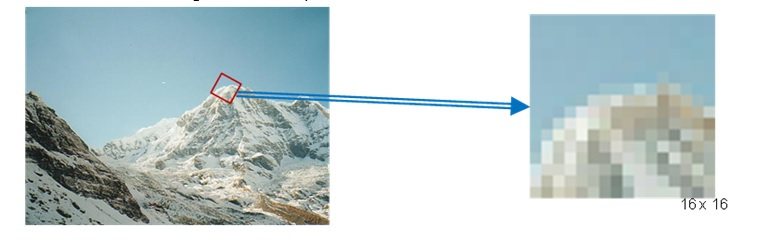

# Questions

## Required Question: Your One of the Project Experience
Q Required) Explain a recent project you've worked on. Why did you choose this project? What difficulties did you run into this project that you did not expect, and how did you solve them?

Ans Required) One of the recent project that i have worked on is one of the Udacity's Sensor fusion Nano degree project: Unscented kalman filter highway project. I chose the additional/bonus section of this project as it involved the application of the Lidar point cloud clustering which was taught as the first lesson of this course.

Difficulty 1: As the measurement noise were fix for the assignment , after changing the Lidar marker as the center location of the bounding box which was tranformed bbox with quaternion as have to keep the orientation of the point cloud in consideration before drawing the box around it. But the rmse and the error increased specially for position x and y for the ukf, though it was marginally more than the given threhold but still was not acceptable. 
	 

Solution & Findings:
Found that i was calculating the tranformed bounding box for the point cloud using pca but with all float percisions, so as rest of the calculations were in double so that was causing the little noise and the offset for the lidar measurement. Changing the data percision to double for all decreased the error and i was able to manage to run the updated code under the rmse threshold. Also the rotation of the bounding box was happening in all 3 dimensions, however it should not happen in z axis; therefore the translation point could not be considered as lmarker directly. Rotation around z axis has to be restricted as the UKF operates in 2D space x and y only.

## First Question
Q1) How do features from algorithms like SIFT, SURF and HOG differ? Explain how these algorithms work, and how you would use them within a perception pipeline.
Ans1) The task of finding correspondences between two images of the same scene or object is part of computer vision. Detector and Descriptors are used to perform this task.
      
HOG: Histograms of Oriented Gradients (HOG). The basic idea behind HOG is to describe the structure of an object by the distribution of its intensity gradients in a local neighborhood. To achieve this, an image is divided into cells in which gradients are computed and collected in a histogram. The set of histograms from all cells is then used as a similarity measure to uniquely identify an image patch or object. Sift and Surf both fall under the umbrella of the HOG family.

SIFT: The SIFT method includes both a keypoint detector as well as  a descriptor and it follows a five-step process, which is briefly outlined in the following.

*  keypoints are detected in the image using an approach called  "Laplacian-Of-Gaussian (LoG)“, which is based on second-degree intensity derivatives. The LoG is applied to various scale levels of the image and tends to detect blobs instead of corners. In addition to a unique scale level, keypoints are also assigned an orientation based on the intensity gradients in a local neighborhood around the keypoint.
* for every keypoint, its surrounding area is transformed by removing the orientation and thus ensuring a canonical orientation. Also, the size of the area is resized to 16 x 16 pixels, providing a normalized patch.

* the orientation and magnitude of each pixel within the normalized patch are computed based on the intensity gradients Ix and Iy.

* the normalized patch is divided into a grid of 4 x 4 cells. Within each cell, the orientations of pixels which exceed a threshold of magnitude are collected in a histogram consisting of 8 bins.

* the 8-bin histograms of all 16 cells are concatenated into a 128-dimensional vector (the descriptor) which is used to uniquely represent the keypoint.

The SIFT detector / descriptor is able to robustly identify objects even among clutter and under partial occlusion. It is invariant to uniform changes in scale, to rotation, to changes in both brightness and contrast and it is even partially invariant to affine distortions.

The downside of SIFT is its low speed, which prevents it from being used in real-time applications on e.g. smartphones.
      
SURF: Speeded Up Robust Features” which introduced a new algorithm called SURF. As name suggests, it is a speeded-up version of SIFT.

In SIFT, Lowe approximated Laplacian of Gaussian with Difference of Gaussian for finding scale-space. SURF goes a little further and approximates LoG with Box Filter. Below image shows a demonstration of such an approximation. One big advantage of this approximation is that, convolution with box filter can be easily calculated with the help of integral images. And it can be done in parallel for different scales. Also the SURF rely on determinant of Hessian matrix for both scale and location.

      
All of these could be used for generating key points/features in a camera frame, which further could be matched between two consecutive frames to get info like object displacment in space and time. Can also be used for tracking multiple objects using associativity  in time. Can also be used for image reconstruction or stiching based on these key point detections. 

## Second Question
Q2) Explain the technique behind Hough Transforms. Where would this type of feature extraction be useful?
Ans2) Principle of Hough Transform : Equation of line is y = mx + a; so points lying on this line will satisfy the  equation; converting the xy space to Hough space formed by the constants of the line equation m and x, so number of lines intersecting and intersection signifies the probablity of line found and number of lines respectively.

Left xy or image feature space and Right is Hough feature space : More the number of lines intersecting means more number of points sampled on a straight line; hence it makes it more certain that there is an edge or a straight line there.

Hough transform can also be performed with Polar representation of a line

Corresponding Hough feature space for the polar coordinate system : Number of extreme white colour coding spots represents number of lines found in an image, in this case four are found.

Hough Transforms line detection technique could useful to detect the lane markings on road or road edges too for the autonomous vehicles.

## Third Question with code
Q3) Describe how a particle filter works, where it is useful, and how it performs against similar algorithms. Code an example of how you update the weights of the particles between steps.

Ans3) Particle filtering uses a set of particles (also called samples) to represent the posterior distribution of some stochastic process given noisy and/or partial observations. The state-space model can be nonlinear and the initial state and noise distributions can take any form required. Particle filter techniques provide a well-established methodology for generating samples(such as Importance sampling principle using proposal and target function) from the required distribution without requiring assumptions about the state-space model or the state distributions. However, these methods do not perform well when applied to very high-dimensional systems. The particle filter methodology is used to solve Hidden Markov Model (HMM) and nonlinear filtering problems.

Particle filters update their prediction in an approximate (statistical) manner. The samples from the distribution are represented by a set of particles; each particle has a likelihood weight assigned to it that represents the probability of that particle being sampled from the probability density function. Weight disparity leading to weight collapse is a common issue encountered in these filtering algorithms; however it can be mitigated by including a resampling step before the weights become too uneven. Several adaptive resampling criteria can be used, including the variance of the weights and the relative entropy with respect to the uniform distribution. In the resampling step, the particles with negligible weights are replaced by new particles in the proximity of the particles with higher weights.

Steps/Stages involved:
* Prediction & Measurement
* Correction
* Resampling

It useful at places where the function is highly non linear and noise values are non Gaussian, as this filtering approach do not rely on any assumption of the distribution to be, as it models distribution by samples on the fly. This makes this filter robust.

However, unlike its counterparts such as kalman filter, Extended Kalman filter and Unscented Kalman filter; it is computationally demanding but more robust to tackle almost any distribution better than others.

For further implementation of updating weights of the particles between steps : Refer to the cpp file ptf in the src folder of the project 
* However, in simple words, weight for any sample is directly proportional to the ratio between the target function at that point and the proposal function at the point. Moreover, when we consider the proposal function as the motion model, the weight is directly infered from the observation model. In the code implementation it is done  using Multivariate Gaussian Distribution(Proposal function). 

## Resampling methods/algorithms

However, in the particle filter implementation, this is done by discrete distribution function in C++ with the help of default_random_engine. 

## Fourth Question follow up to the third Question
Q Follow-up) How is Unscented kalman filter different and similar to the Particle filter as both are intended to handle non linear system with non Gaussian Noise, but have different application areas. 

Ans Follow-up) The unscented Kalman filter (UKF) provides a balance between the low computational effort of the Kalman filter and the high performance of the particle filter.

The particle filter has some similarities with the UKF in that it transforms a set of points via known nonlinear equations and combines the results to estimate the mean and covariance of the state. However, in the particle filter the points are chosen randomly, whereas in the UKF the points are chosen on the basis of a specific algorithm*. Because of this, the number of points used in a particle filter generally needs to be much greater than the number of points in a UKF. Another difference between the two filters is that the estimation error in a UKF does not converge to zero in any sense, but the estimation error in a particle filter does converge to zero as the number of particles (and hence the computational effort) approaches infinity.

